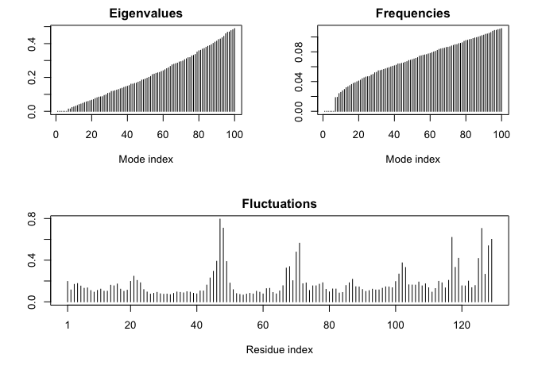

Class 11 : Structural Bioinformatics 1
================

The PDB Database
----------------

PDB Database Composition We've set column 1 as the row names for this data set

``` r
stats <- read.csv("Data Export Summary.csv", row.names = 1)
stats
```

    ##                     Proteins Nucleic.Acids Protein.NA.Complex Other  Total
    ## X-Ray                 124770          1993               6451    10 133224
    ## NMR                    10988          1273                257     8  12526
    ## Electron Microscopy     2057            31                723     0   2811
    ## Other                    250             4                  6    13    273
    ## Multi Method             127             5                  2     1    135

Q1: Determine the percentage of structures solved by X-Ray and Electron Microscopy. Also can you determine what proportion of structures are protein

``` r
sum(stats$Total)
```

    ## [1] 148969

``` r
sum
```

    ## function (..., na.rm = FALSE)  .Primitive("sum")

Above code solves for total data in all entire stats data set Let's separate these by methods

``` r
pre.by.method <- stats$Total/sum(stats$Total)*100
names(pre.by.method) <- rownames(stats)
pre.by.method
```

    ##               X-Ray                 NMR Electron Microscopy 
    ##         89.43068692          8.40846082          1.88696977 
    ##               Other        Multi Method 
    ##          0.18325960          0.09062288

Q: What proportion of structures are protein?

``` r
byprotein <- sum(stats$Proteins)/sum(stats$Total)*100
round(byprotein, 2)
```

    ## [1] 92.77

To install R Data pasta: install.packages("datapasta") in console

``` r
data.frame(stringsAsFactors = FALSE,
   Experimental.Method = c("X-Ray", "NMR", "Electron Microscopy", "Other",
                           "Multi Method", "Total"),
              Proteins = c(124770, 10988, 2057, 250, 127, 138192),
         Nucleic.Acids = c(1993, 1273, 31, 4, 5, 3306),
    ProteinNA.Complex = c(6451, 257, 723, 6, 2, 7439),
                 Other = c(10, 8, 0, 13, 1, 32),
                 Total = c(133224, 12526, 2811, 273, 135, 148969)
)
```

    ##   Experimental.Method Proteins Nucleic.Acids ProteinNA.Complex Other
    ## 1               X-Ray   124770          1993              6451    10
    ## 2                 NMR    10988          1273               257     8
    ## 3 Electron Microscopy     2057            31               723     0
    ## 4               Other      250             4                 6    13
    ## 5        Multi Method      127             5                 2     1
    ## 6               Total   138192          3306              7439    32
    ##    Total
    ## 1 133224
    ## 2  12526
    ## 3   2811
    ## 4    273
    ## 5    135
    ## 6 148969

Introduction to Bio3D in R
--------------------------

Load the Bio3D package; list fns via lbio3d() in consol

``` r
library(bio3d)
```

``` r
hsg1 <- read.pdb("1hsg.pdb")
hsg1
```

    ## 
    ##  Call:  read.pdb(file = "1hsg.pdb")
    ## 
    ##    Total Models#: 1
    ##      Total Atoms#: 1686,  XYZs#: 5058  Chains#: 2  (values: A B)
    ## 
    ##      Protein Atoms#: 1514  (residues/Calpha atoms#: 198)
    ##      Nucleic acid Atoms#: 0  (residues/phosphate atoms#: 0)
    ## 
    ##      Non-protein/nucleic Atoms#: 172  (residues: 128)
    ##      Non-protein/nucleic resid values: [ HOH (127), MK1 (1) ]
    ## 
    ##    Protein sequence:
    ##       PQITLWQRPLVTIKIGGQLKEALLDTGADDTVLEEMSLPGRWKPKMIGGIGGFIKVRQYD
    ##       QILIEICGHKAIGTVLVGPTPVNIIGRNLLTQIGCTLNFPQITLWQRPLVTIKIGGQLKE
    ##       ALLDTGADDTVLEEMSLPGRWKPKMIGGIGGFIKVRQYDQILIEICGHKAIGTVLVGPTP
    ##       VNIIGRNLLTQIGCTLNF
    ## 
    ## + attr: atom, xyz, seqres, helix, sheet,
    ##         calpha, remark, call

``` r
pdb <- read.pdb("1hsg")
```

    ##   Note: Accessing on-line PDB file

So Barry's lab has this dev version of bio3d that allows for 3D biomolecular structure viewing in R itself. Then you don't have to rely on opening written-out PDB files in programs such as VMD or PyMol

``` r
#install.packages("devtools")
#devtools::install_bitbucket("Grantlab/bio3d-view")
```

Let's try it out

``` r
library(bio3d.view)
library(rgl)
```

    ## Warning in rgl.init(initValue, onlyNULL): RGL: unable to open X11 display

    ## Warning: 'rgl_init' failed, running with rgl.useNULL = TRUE

``` r
view(pdb)
```

    ## Computing connectivity from coordinates...

Nope, can't load the rgl package.

Moving on with our lives--

Extract the protein only portion of this PDB structure: \#Section 4: Atom Selection

``` r
ca.inds <- atom.select(pdb, "calpha")
ca.inds
```

    ## 
    ##  Call:  atom.select.pdb(pdb = pdb, string = "calpha")
    ## 
    ##    Atom Indices#: 198  ($atom)
    ##    XYZ  Indices#: 594  ($xyz)
    ## 
    ## + attr: atom, xyz, call

Atom indices is the atom \# I think.. And the xyz is the numeric vector to access the xyz componnet of the input PDB structure object

So there are 198 calpha's in pdb.. , each with its 3\# xyz coordinate (198 x 3 = 594)

But where exactly are they?

``` r
pdb$atom[ca.inds$atom,]
```

    ##      type eleno elety  alt resid chain resno insert      x      y       z
    ## 2    ATOM     2    CA <NA>   PRO     A     1   <NA> 30.307 38.663   5.319
    ## 9    ATOM     9    CA <NA>   GLN     A     2   <NA> 30.158 36.492   2.199
    ## 18   ATOM    18    CA <NA>   ILE     A     3   <NA> 29.123 33.098   3.397
    ## 26   ATOM    26    CA <NA>   THR     A     4   <NA> 29.774 30.143   1.062
    ## 33   ATOM    33    CA <NA>   LEU     A     5   <NA> 27.644 27.003   1.144
    ## 41   ATOM    41    CA <NA>   TRP     A     6   <NA> 30.177 24.150   1.279
    ## 55   ATOM    55    CA <NA>   GLN     A     7   <NA> 29.141 23.799   4.960
    ## 64   ATOM    64    CA <NA>   ARG     A     8   <NA> 25.757 24.566   6.593
    ## 75   ATOM    75    CA <NA>   PRO     A     9   <NA> 25.491 28.352   6.938
    ## 82   ATOM    82    CA <NA>   LEU     A    10   <NA> 25.653 28.510  10.750
    ## 90   ATOM    90    CA <NA>   VAL     A    11   <NA> 26.267 31.854  12.497
    ## 97   ATOM    97    CA <NA>   THR     A    12   <NA> 26.001 33.143  16.102
    ## 104  ATOM   104    CA <NA>   ILE     A    13   <NA> 22.842 34.875  17.206
    ## 112  ATOM   112    CA <NA>   LYS     A    14   <NA> 21.894 36.545  20.492
    ## 121  ATOM   121    CA <NA>   ILE     A    15   <NA> 18.345 36.563  21.813
    ## 129  ATOM   129    CA <NA>   GLY     A    16   <NA> 17.356 36.968  25.459
    ## 133  ATOM   133    CA <NA>   GLY     A    17   <NA> 20.970 37.660  26.340
    ## 137  ATOM   137    CA <NA>   GLN     A    18   <NA> 21.780 34.106  25.263
    ## 146  ATOM   146    CA <NA>   LEU     A    19   <NA> 24.334 33.365  22.552
    ## 154  ATOM   154    CA <NA>   LYS     A    20   <NA> 23.006 30.584  20.266
    ## 163  ATOM   163    CA <NA>   GLU     A    21   <NA> 24.053 29.117  16.931
    ## 172  ATOM   172    CA <NA>   ALA     A    22   <NA> 21.553 29.189  14.165
    ## 177  ATOM   177    CA <NA>   LEU     A    23   <NA> 21.047 28.473  10.476
    ## 185  ATOM   185    CA <NA>   LEU     A    24   <NA> 20.617 31.144   7.775
    ## 193  ATOM   193    CA <NA>   ASP     A    25   <NA> 17.853 29.516   5.837
    ## 201  ATOM   201    CA <NA>   THR     A    26   <NA> 16.548 31.148   2.684
    ## 208  ATOM   208    CA <NA>   GLY     A    27   <NA> 14.043 28.331   2.349
    ## 212  ATOM   212    CA <NA>   ALA     A    28   <NA> 12.324 29.192   5.642
    ## 217  ATOM   217    CA <NA>   ASP     A    29   <NA>  9.512 31.798   5.651
    ## 225  ATOM   225    CA <NA>   ASP     A    30   <NA>  9.718 32.168   9.444
    ## 233  ATOM   233    CA <NA>   THR     A    31   <NA> 12.248 32.053  12.215
    ## 240  ATOM   240    CA <NA>   VAL     A    32   <NA> 11.893 28.983  14.419
    ## 247  ATOM   247    CA <NA>   LEU     A    33   <NA> 13.996 28.594  17.500
    ## 255  ATOM   255    CA <NA>   GLU     A    34   <NA> 14.390 25.650  19.874
    ## 264  ATOM   264    CA <NA>   GLU     A    35   <NA> 12.183 25.482  22.981
    ## 273  ATOM   273    CA <NA>   MET     A    36   <NA> 13.101 28.479  25.261
    ## 281  ATOM   281    CA <NA>   SER     A    37   <NA> 11.163 31.036  27.460
    ## 287  ATOM   287    CA <NA>   LEU     A    38   <NA> 10.566 34.476  26.033
    ## 295  ATOM   295    CA <NA>   PRO     A    39   <NA>  8.980 37.700  27.301
    ## 302  ATOM   302    CA <NA>   GLY     A    40   <NA>  5.419 38.218  26.302
    ## 306  ATOM   306    CA <NA>   ARG     A    41   <NA>  2.382 36.252  25.509
    ## 317  ATOM   317    CA <NA>   TRP     A    42   <NA>  2.295 33.862  22.533
    ## 331  ATOM   331    CA <NA>   LYS     A    43   <NA> -0.305 32.776  19.928
    ## 340  ATOM   340    CA <NA>   PRO     A    44   <NA> -0.088 29.114  18.966
    ## 347  ATOM   347    CA <NA>   LYS     A    45   <NA>  0.634 28.302  15.290
    ## 356  ATOM   356    CA <NA>   MET     A    46   <NA>  1.091 25.232  13.081
    ## 364  ATOM   364    CA <NA>   ILE     A    47   <NA>  3.978 25.464  10.655
    ## 372  ATOM   372    CA <NA>   GLY     A    48   <NA>  4.886 22.777   8.145
    ## 376  ATOM   376    CA <NA>   GLY     A    49   <NA>  8.313 21.471   7.276
    ## 380  ATOM   380    CA <NA>   ILE     A    50   <NA>  9.537 18.544   5.194
    ## 388  ATOM   388    CA <NA>   GLY     A    51   <NA>  8.174 15.771   7.405
    ## 392  ATOM   392    CA <NA>   GLY     A    52   <NA>  4.855 17.480   8.157
    ## 396  ATOM   396    CA <NA>   PHE     A    53   <NA>  3.593 19.996  10.731
    ## 407  ATOM   407    CA <NA>   ILE     A    54   <NA>  4.689 21.005  14.248
    ## 415  ATOM   415    CA <NA>   LYS     A    55   <NA>  2.968 23.196  16.823
    ## 424  ATOM   424    CA <NA>   VAL     A    56   <NA>  4.927 26.319  17.754
    ## 431  ATOM   431    CA <NA>   ARG     A    57   <NA>  4.459 29.271  20.026
    ## 442  ATOM   442    CA <NA>   GLN     A    58   <NA>  4.570 32.596  18.172
    ## 451  ATOM   451    CA <NA>   TYR     A    59   <NA>  6.097 35.658  19.896
    ## 463  ATOM   463    CA <NA>   ASP     A    60   <NA>  6.022 39.045  18.125
    ## 471  ATOM   471    CA <NA>   GLN     A    61   <NA>  8.337 42.060  18.331
    ## 480  ATOM   480    CA <NA>   ILE     A    62   <NA> 11.484 40.115  19.328
    ## 488  ATOM   488    CA <NA>   LEU     A    63   <NA> 15.038 41.476  18.822
    ## 496  ATOM   496    CA <NA>   ILE     A    64   <NA> 17.760 39.039  17.653
    ## 504  ATOM   504    CA <NA>   GLU     A    65   <NA> 21.406 39.983  17.036
    ## 513  ATOM   513    CA <NA>   ILE     A    66   <NA> 22.818 38.327  13.863
    ## 521  ATOM   521    CA <NA>   CYS     A    67   <NA> 26.590 38.871  13.351
    ## 527  ATOM   527    CA <NA>   GLY     A    68   <NA> 26.319 42.307  14.938
    ## 531  ATOM   531    CA <NA>   HIS     A    69   <NA> 23.251 43.368  13.013
    ## 541  ATOM   541    CA <NA>   LYS     A    70   <NA> 20.030 43.883  14.945
    ## 550  ATOM   550    CA <NA>   ALA     A    71   <NA> 16.703 42.737  13.499
    ## 555  ATOM   555    CA <NA>   ILE     A    72   <NA> 13.233 42.663  15.111
    ## 563  ATOM   563    CA <NA>   GLY     A    73   <NA> 10.359 40.420  14.090
    ## 567  ATOM   567    CA <NA>   THR     A    74   <NA>  8.224 37.361  14.786
    ## 574  ATOM   574    CA <NA>   VAL     A    75   <NA>  9.944 34.420  16.291
    ## 581  ATOM   581    CA <NA>   LEU     A    76   <NA>  8.353 30.995  16.628
    ## 589  ATOM   589    CA <NA>   VAL     A    77   <NA>  9.519 28.691  19.405
    ## 596  ATOM   596    CA <NA>   GLY     A    78   <NA>  9.027 24.918  19.185
    ## 600  ATOM   600    CA <NA>   PRO     A    79   <NA> 10.442 21.388  18.731
    ## 607  ATOM   607    CA <NA>   THR     A    80   <NA> 12.910 22.043  15.936
    ## 614  ATOM   614    CA <NA>   PRO     A    81   <NA> 16.233 20.170  15.766
    ## 621  ATOM   621    CA <NA>   VAL     A    82   <NA> 18.236 23.243  14.762
    ## 628  ATOM   628    CA <NA>   ASN     A    83   <NA> 17.731 27.051  15.193
    ## 636  ATOM   636    CA <NA>   ILE     A    84   <NA> 16.588 28.651  11.955
    ## 644  ATOM   644    CA <NA>   ILE     A    85   <NA> 16.710 32.257  10.821
    ## 652  ATOM   652    CA <NA>   GLY     A    86   <NA> 14.238 32.655   8.011
    ## 656  ATOM   656    CA <NA>   ARG     A    87   <NA> 13.370 35.302   5.456
    ## 667  ATOM   667    CA <NA>   ASN     A    88   <NA> 11.458 37.455   7.919
    ## 675  ATOM   675    CA <NA>   LEU     A    89   <NA> 14.633 38.337   9.729
    ## 683  ATOM   683    CA <NA>   LEU     A    90   <NA> 17.078 37.773   6.865
    ## 691  ATOM   691    CA <NA>   THR     A    91   <NA> 15.653 40.738   4.985
    ## 698  ATOM   698    CA <NA>   GLN     A    92   <NA> 16.170 43.099   7.967
    ## 707  ATOM   707    CA <NA>   ILE     A    93   <NA> 19.887 42.417   8.035
    ## 715  ATOM   715    CA <NA>   GLY     A    94   <NA> 20.226 42.870   4.327
    ## 719  ATOM   719    CA <NA>   CYS     A    95   <NA> 20.890 39.296   3.297
    ## 725  ATOM   725    CA <NA>   THR     A    96   <NA> 20.969 38.276  -0.346
    ## 732  ATOM   732    CA <NA>   LEU     A    97   <NA> 21.718 35.228  -2.473
    ## 740  ATOM   740    CA <NA>   ASN     A    98   <NA> 24.207 35.904  -5.257
    ## 748  ATOM   748    CA <NA>   PHE     A    99   <NA> 25.376 33.754  -8.172
    ## 759  ATOM   760    CA <NA>   PRO     B     1   <NA> 21.708 37.741 -10.269
    ## 766  ATOM   767    CA <NA>   GLN     B     2   <NA> 21.156 39.043  -6.744
    ## 775  ATOM   776    CA <NA>   ILE     B     3   <NA> 18.037 37.742  -5.100
    ## 783  ATOM   784    CA <NA>   THR     B     4   <NA> 16.635 39.571  -2.117
    ## 790  ATOM   791    CA <NA>   LEU     B     5   <NA> 14.466 37.636   0.259
    ## 798  ATOM   799    CA <NA>   TRP     B     6   <NA> 11.260 39.582   0.682
    ## 812  ATOM   813    CA <NA>   GLN     B     7   <NA>  9.518 36.960  -1.516
    ## 821  ATOM   822    CA <NA>   ARG     B     8   <NA> 10.385 33.251  -1.642
    ## 832  ATOM   833    CA <NA>   PRO     B     9   <NA> 13.443 32.743  -3.746
    ## 839  ATOM   840    CA <NA>   LEU     B    10   <NA> 11.816 30.740  -6.534
    ## 847  ATOM   848    CA <NA>   VAL     B    11   <NA> 13.759 30.227  -9.768
    ## 854  ATOM   855    CA <NA>   THR     B    12   <NA> 12.809 28.220 -12.873
    ## 861  ATOM   862    CA <NA>   ILE     B    13   <NA> 14.708 24.966 -13.446
    ## 869  ATOM   870    CA <NA>   LYS     B    14   <NA> 14.828 22.733 -16.464
    ## 878  ATOM   879    CA <NA>   ILE     B    15   <NA> 15.108 18.999 -15.906
    ## 886  ATOM   887    CA <NA>   GLY     B    16   <NA> 14.024 16.279 -18.286
    ## 890  ATOM   891    CA <NA>   GLY     B    17   <NA> 13.243 18.938 -20.850
    ## 894  ATOM   895    CA <NA>   GLN     B    18   <NA> 10.572 20.249 -18.515
    ## 903  ATOM   904    CA <NA>   LEU     B    19   <NA> 10.450 23.647 -16.749
    ## 911  ATOM   912    CA <NA>   LYS     B    20   <NA>  9.576 23.583 -13.044
    ## 920  ATOM   921    CA <NA>   GLU     B    21   <NA>  9.705 26.075 -10.199
    ## 929  ATOM   930    CA <NA>   ALA     B    22   <NA> 12.025 25.431  -7.271
    ## 934  ATOM   935    CA <NA>   LEU     B    23   <NA> 13.017 27.151  -4.001
    ## 942  ATOM   943    CA <NA>   LEU     B    24   <NA> 16.672 28.114  -3.511
    ## 950  ATOM   951    CA <NA>   ASP     B    25   <NA> 17.227 26.751  -0.026
    ## 958  ATOM   959    CA <NA>   THR     B    26   <NA> 20.441 27.290   1.920
    ## 965  ATOM   966    CA <NA>   GLY     B    27   <NA> 18.957 25.372   4.876
    ## 969  ATOM   970    CA <NA>   ALA     B    28   <NA> 18.721 22.211   2.738
    ## 974  ATOM   975    CA <NA>   ASP     B    29   <NA> 21.779 19.912   2.496
    ## 982  ATOM   983    CA <NA>   ASP     B    30   <NA> 20.355 18.227  -0.584
    ## 990  ATOM   991    CA <NA>   THR     B    31   <NA> 18.113 18.843  -3.603
    ## 997  ATOM   998    CA <NA>   VAL     B    32   <NA> 14.628 17.162  -3.514
    ## 1004 ATOM  1005    CA <NA>   LEU     B    33   <NA> 12.141 17.335  -6.327
    ## 1012 ATOM  1013    CA <NA>   GLU     B    34   <NA>  8.442 16.392  -6.346
    ## 1021 ATOM  1022    CA <NA>   GLU     B    35   <NA>  7.425 13.006  -7.682
    ## 1030 ATOM  1031    CA <NA>   MET     B    36   <NA>  8.791 12.578 -11.145
    ## 1038 ATOM  1039    CA <NA>   SER     B    37   <NA> 10.411  9.858 -13.218
    ## 1044 ATOM  1045    CA <NA>   LEU     B    38   <NA> 14.091 10.261 -13.857
    ## 1052 ATOM  1053    CA <NA>   PRO     B    39   <NA> 16.525  8.031 -15.798
    ## 1059 ATOM  1060    CA <NA>   GLY     B    40   <NA> 18.494  5.171 -14.302
    ## 1063 ATOM  1064    CA <NA>   ARG     B    41   <NA> 18.722  3.282 -11.042
    ## 1074 ATOM  1075    CA <NA>   TRP     B    42   <NA> 17.920  4.766  -7.634
    ## 1088 ATOM  1089    CA <NA>   LYS     B    43   <NA> 19.180  4.182  -4.032
    ## 1097 ATOM  1098    CA <NA>   PRO     B    44   <NA> 17.102  4.804  -0.946
    ## 1104 ATOM  1105    CA <NA>   LYS     B    45   <NA> 17.443  7.812   1.371
    ## 1113 ATOM  1114    CA <NA>   MET     B    46   <NA> 15.755  9.281   4.404
    ## 1121 ATOM  1122    CA <NA>   ILE     B    47   <NA> 16.003 12.986   4.955
    ## 1129 ATOM  1130    CA <NA>   GLY     B    48   <NA> 14.714 14.799   8.014
    ## 1133 ATOM  1134    CA <NA>   GLY     B    49   <NA> 13.484 18.319   8.459
    ## 1137 ATOM  1138    CA <NA>   ILE     B    50   <NA> 10.858 19.974  10.594
    ## 1145 ATOM  1146    CA <NA>   GLY     B    51   <NA>  8.011 17.583  11.313
    ## 1149 ATOM  1150    CA <NA>   GLY     B    52   <NA> 10.123 14.474  10.792
    ## 1153 ATOM  1154    CA <NA>   PHE     B    53   <NA> 11.638 12.302   8.079
    ## 1164 ATOM  1165    CA <NA>   ILE     B    54   <NA> 10.538 11.431   4.563
    ## 1172 ATOM  1173    CA <NA>   LYS     B    55   <NA> 11.816  8.478   2.482
    ## 1181 ATOM  1182    CA <NA>   VAL     B    56   <NA> 13.072  9.652  -0.897
    ## 1188 ATOM  1189    CA <NA>   ARG     B    57   <NA> 14.697  8.220  -4.083
    ## 1199 ATOM  1200    CA <NA>   GLN     B    58   <NA> 18.306  9.218  -4.819
    ## 1208 ATOM  1209    CA <NA>   TYR     B    59   <NA> 19.361  9.587  -8.464
    ## 1220 ATOM  1221    CA <NA>   ASP     B    60   <NA> 22.959 10.470  -9.336
    ## 1228 ATOM  1229    CA <NA>   GLN     B    61   <NA> 24.622 12.478 -12.111
    ## 1237 ATOM  1238    CA <NA>   ILE     B    62   <NA> 21.380 14.141 -13.224
    ## 1245 ATOM  1246    CA <NA>   LEU     B    63   <NA> 21.600 17.263 -15.431
    ## 1253 ATOM  1254    CA <NA>   ILE     B    64   <NA> 19.548 20.111 -14.029
    ## 1261 ATOM  1262    CA <NA>   GLU     B    65   <NA> 19.661 23.719 -15.251
    ## 1270 ATOM  1271    CA <NA>   ILE     B    66   <NA> 19.159 26.431 -12.654
    ## 1278 ATOM  1279    CA <NA>   CYS     B    67   <NA> 18.684 29.971 -14.104
    ## 1284 ATOM  1285    CA <NA>   GLY     B    68   <NA> 20.485 28.891 -17.256
    ## 1288 ATOM  1289    CA <NA>   HIS     B    69   <NA> 23.354 27.479 -15.197
    ## 1298 ATOM  1299    CA <NA>   LYS     B    70   <NA> 23.935 23.791 -15.800
    ## 1307 ATOM  1308    CA <NA>   ALA     B    71   <NA> 24.689 21.612 -12.802
    ## 1312 ATOM  1313    CA <NA>   ILE     B    72   <NA> 25.048 17.816 -13.016
    ## 1320 ATOM  1321    CA <NA>   GLY     B    73   <NA> 24.545 16.248  -9.616
    ## 1324 ATOM  1325    CA <NA>   THR     B    74   <NA> 22.568 14.162  -7.116
    ## 1331 ATOM  1332    CA <NA>   VAL     B    75   <NA> 18.832 14.773  -7.068
    ## 1338 ATOM  1339    CA <NA>   LEU     B    76   <NA> 16.390 13.196  -4.575
    ## 1346 ATOM  1347    CA <NA>   VAL     B    77   <NA> 12.749 12.509  -5.485
    ## 1353 ATOM  1354    CA <NA>   GLY     B    78   <NA> 10.004 12.229  -2.965
    ## 1357 ATOM  1358    CA <NA>   PRO     B    79   <NA>  6.887 13.664  -1.350
    ## 1364 ATOM  1365    CA <NA>   THR     B    80   <NA>  8.324 17.137  -0.702
    ## 1371 ATOM  1372    CA <NA>   PRO     B    81   <NA>  5.896 20.066  -0.556
    ## 1378 ATOM  1379    CA <NA>   VAL     B    82   <NA>  7.990 22.207  -2.983
    ## 1385 ATOM  1386    CA <NA>   ASN     B    83   <NA> 10.914 21.521  -5.319
    ## 1393 ATOM  1394    CA <NA>   ILE     B    84   <NA> 13.979 22.449  -3.233
    ## 1401 ATOM  1402    CA <NA>   ILE     B    85   <NA> 17.441 23.243  -4.575
    ## 1409 ATOM  1410    CA <NA>   GLY     B    86   <NA> 19.857 22.642  -1.690
    ## 1413 ATOM  1414    CA <NA>   ARG     B    87   <NA> 23.533 23.126  -0.985
    ## 1424 ATOM  1425    CA <NA>   ASN     B    88   <NA> 24.950 20.312  -3.132
    ## 1432 ATOM  1433    CA <NA>   LEU     B    89   <NA> 23.811 22.125  -6.273
    ## 1440 ATOM  1441    CA <NA>   LEU     B    90   <NA> 24.020 25.701  -4.954
    ## 1448 ATOM  1449    CA <NA>   THR     B    91   <NA> 27.785 25.304  -4.546
    ## 1455 ATOM  1456    CA <NA>   GLN     B    92   <NA> 28.009 24.110  -8.150
    ## 1464 ATOM  1465    CA <NA>   ILE     B    93   <NA> 26.362 27.233  -9.606
    ## 1472 ATOM  1473    CA <NA>   GLY     B    94   <NA> 28.481 29.498  -7.421
    ## 1476 ATOM  1477    CA <NA>   CYS     B    95   <NA> 25.895 30.718  -5.004
    ## 1482 ATOM  1483    CA <NA>   THR     B    96   <NA> 26.794 32.734  -1.882
    ## 1489 ATOM  1490    CA <NA>   LEU     B    97   <NA> 24.902 34.468   0.963
    ## 1497 ATOM  1498    CA <NA>   ASN     B    98   <NA> 25.870 38.101   1.449
    ## 1505 ATOM  1506    CA <NA>   PHE     B    99   <NA> 25.267 40.855   4.034
    ##      o     b segid elesy charge
    ## 2    1 40.62  <NA>     C   <NA>
    ## 9    1 41.30  <NA>     C   <NA>
    ## 18   1 34.13  <NA>     C   <NA>
    ## 26   1 30.14  <NA>     C   <NA>
    ## 33   1 30.12  <NA>     C   <NA>
    ## 41   1 30.82  <NA>     C   <NA>
    ## 55   1 32.37  <NA>     C   <NA>
    ## 64   1 29.87  <NA>     C   <NA>
    ## 75   1 29.48  <NA>     C   <NA>
    ## 82   1 31.57  <NA>     C   <NA>
    ## 90   1 30.14  <NA>     C   <NA>
    ## 97   1 32.56  <NA>     C   <NA>
    ## 104  1 32.26  <NA>     C   <NA>
    ## 112  1 38.20  <NA>     C   <NA>
    ## 121  1 46.34  <NA>     C   <NA>
    ## 129  1 56.32  <NA>     C   <NA>
    ## 133  1 59.71  <NA>     C   <NA>
    ## 137  1 58.98  <NA>     C   <NA>
    ## 146  1 49.32  <NA>     C   <NA>
    ## 154  1 44.52  <NA>     C   <NA>
    ## 163  1 40.02  <NA>     C   <NA>
    ## 172  1 26.79  <NA>     C   <NA>
    ## 177  1 25.08  <NA>     C   <NA>
    ## 185  1 18.03  <NA>     C   <NA>
    ## 193  1 18.91  <NA>     C   <NA>
    ## 201  1 15.16  <NA>     C   <NA>
    ## 208  1 14.06  <NA>     C   <NA>
    ## 212  1 13.20  <NA>     C   <NA>
    ## 217  1 19.68  <NA>     C   <NA>
    ## 225  1 22.55  <NA>     C   <NA>
    ## 233  1 19.28  <NA>     C   <NA>
    ## 240  1 20.18  <NA>     C   <NA>
    ## 247  1 24.48  <NA>     C   <NA>
    ## 255  1 32.79  <NA>     C   <NA>
    ## 264  1 33.85  <NA>     C   <NA>
    ## 273  1 32.08  <NA>     C   <NA>
    ## 281  1 33.81  <NA>     C   <NA>
    ## 287  1 38.10  <NA>     C   <NA>
    ## 295  1 45.32  <NA>     C   <NA>
    ## 302  1 44.04  <NA>     C   <NA>
    ## 306  1 48.14  <NA>     C   <NA>
    ## 317  1 40.42  <NA>     C   <NA>
    ## 331  1 38.61  <NA>     C   <NA>
    ## 340  1 36.73  <NA>     C   <NA>
    ## 347  1 31.98  <NA>     C   <NA>
    ## 356  1 28.75  <NA>     C   <NA>
    ## 364  1 25.64  <NA>     C   <NA>
    ## 372  1 28.25  <NA>     C   <NA>
    ## 376  1 33.92  <NA>     C   <NA>
    ## 380  1 40.56  <NA>     C   <NA>
    ## 388  1 37.36  <NA>     C   <NA>
    ## 392  1 34.71  <NA>     C   <NA>
    ## 396  1 30.76  <NA>     C   <NA>
    ## 407  1 28.83  <NA>     C   <NA>
    ## 415  1 31.37  <NA>     C   <NA>
    ## 424  1 26.79  <NA>     C   <NA>
    ## 431  1 29.29  <NA>     C   <NA>
    ## 442  1 27.73  <NA>     C   <NA>
    ## 451  1 34.57  <NA>     C   <NA>
    ## 463  1 36.50  <NA>     C   <NA>
    ## 471  1 37.27  <NA>     C   <NA>
    ## 480  1 33.95  <NA>     C   <NA>
    ## 488  1 41.38  <NA>     C   <NA>
    ## 496  1 46.55  <NA>     C   <NA>
    ## 504  1 52.65  <NA>     C   <NA>
    ## 513  1 53.69  <NA>     C   <NA>
    ## 521  1 59.30  <NA>     C   <NA>
    ## 527  1 56.53  <NA>     C   <NA>
    ## 531  1 49.83  <NA>     C   <NA>
    ## 541  1 44.00  <NA>     C   <NA>
    ## 550  1 33.57  <NA>     C   <NA>
    ## 555  1 26.93  <NA>     C   <NA>
    ## 563  1 22.07  <NA>     C   <NA>
    ## 567  1 24.46  <NA>     C   <NA>
    ## 574  1 26.87  <NA>     C   <NA>
    ## 581  1 25.80  <NA>     C   <NA>
    ## 589  1 25.77  <NA>     C   <NA>
    ## 596  1 25.28  <NA>     C   <NA>
    ## 600  1 26.27  <NA>     C   <NA>
    ## 607  1 27.04  <NA>     C   <NA>
    ## 614  1 28.35  <NA>     C   <NA>
    ## 621  1 30.36  <NA>     C   <NA>
    ## 628  1 23.14  <NA>     C   <NA>
    ## 636  1 18.70  <NA>     C   <NA>
    ## 644  1 17.84  <NA>     C   <NA>
    ## 652  1 19.47  <NA>     C   <NA>
    ## 656  1 21.43  <NA>     C   <NA>
    ## 667  1 19.12  <NA>     C   <NA>
    ## 675  1 21.46  <NA>     C   <NA>
    ## 683  1 21.90  <NA>     C   <NA>
    ## 691  1 25.31  <NA>     C   <NA>
    ## 698  1 23.15  <NA>     C   <NA>
    ## 707  1 25.37  <NA>     C   <NA>
    ## 715  1 25.09  <NA>     C   <NA>
    ## 719  1 26.34  <NA>     C   <NA>
    ## 725  1 27.51  <NA>     C   <NA>
    ## 732  1 26.62  <NA>     C   <NA>
    ## 740  1 29.12  <NA>     C   <NA>
    ## 748  1 35.14  <NA>     C   <NA>
    ## 759  1 43.36  <NA>     C   <NA>
    ## 766  1 37.15  <NA>     C   <NA>
    ## 775  1 30.91  <NA>     C   <NA>
    ## 783  1 26.46  <NA>     C   <NA>
    ## 790  1 21.45  <NA>     C   <NA>
    ## 798  1 21.58  <NA>     C   <NA>
    ## 812  1 24.55  <NA>     C   <NA>
    ## 821  1 20.70  <NA>     C   <NA>
    ## 832  1 16.67  <NA>     C   <NA>
    ## 839  1 24.75  <NA>     C   <NA>
    ## 847  1 25.94  <NA>     C   <NA>
    ## 854  1 29.59  <NA>     C   <NA>
    ## 861  1 26.55  <NA>     C   <NA>
    ## 869  1 26.92  <NA>     C   <NA>
    ## 878  1 30.24  <NA>     C   <NA>
    ## 886  1 39.96  <NA>     C   <NA>
    ## 890  1 37.08  <NA>     C   <NA>
    ## 894  1 35.03  <NA>     C   <NA>
    ## 903  1 29.37  <NA>     C   <NA>
    ## 911  1 25.77  <NA>     C   <NA>
    ## 920  1 25.39  <NA>     C   <NA>
    ## 929  1 14.52  <NA>     C   <NA>
    ## 934  1 15.39  <NA>     C   <NA>
    ## 942  1 17.92  <NA>     C   <NA>
    ## 950  1 18.20  <NA>     C   <NA>
    ## 958  1 13.68  <NA>     C   <NA>
    ## 965  1 13.54  <NA>     C   <NA>
    ## 969  1 18.89  <NA>     C   <NA>
    ## 974  1 14.85  <NA>     C   <NA>
    ## 982  1 15.10  <NA>     C   <NA>
    ## 990  1 15.45  <NA>     C   <NA>
    ## 997  1 18.71  <NA>     C   <NA>
    ## 1004 1 23.84  <NA>     C   <NA>
    ## 1012 1 26.40  <NA>     C   <NA>
    ## 1021 1 32.05  <NA>     C   <NA>
    ## 1030 1 33.53  <NA>     C   <NA>
    ## 1038 1 35.84  <NA>     C   <NA>
    ## 1044 1 34.72  <NA>     C   <NA>
    ## 1052 1 40.91  <NA>     C   <NA>
    ## 1059 1 33.54  <NA>     C   <NA>
    ## 1063 1 28.95  <NA>     C   <NA>
    ## 1074 1 28.18  <NA>     C   <NA>
    ## 1088 1 30.18  <NA>     C   <NA>
    ## 1097 1 25.30  <NA>     C   <NA>
    ## 1104 1 28.39  <NA>     C   <NA>
    ## 1113 1 31.16  <NA>     C   <NA>
    ## 1121 1 29.85  <NA>     C   <NA>
    ## 1129 1 31.93  <NA>     C   <NA>
    ## 1133 1 34.90  <NA>     C   <NA>
    ## 1137 1 35.93  <NA>     C   <NA>
    ## 1145 1 34.23  <NA>     C   <NA>
    ## 1149 1 35.14  <NA>     C   <NA>
    ## 1153 1 33.93  <NA>     C   <NA>
    ## 1164 1 28.82  <NA>     C   <NA>
    ## 1172 1 31.48  <NA>     C   <NA>
    ## 1181 1 26.87  <NA>     C   <NA>
    ## 1188 1 21.61  <NA>     C   <NA>
    ## 1199 1 21.62  <NA>     C   <NA>
    ## 1208 1 19.01  <NA>     C   <NA>
    ## 1220 1 25.69  <NA>     C   <NA>
    ## 1228 1 29.27  <NA>     C   <NA>
    ## 1237 1 24.82  <NA>     C   <NA>
    ## 1245 1 29.84  <NA>     C   <NA>
    ## 1253 1 31.52  <NA>     C   <NA>
    ## 1261 1 34.26  <NA>     C   <NA>
    ## 1270 1 36.05  <NA>     C   <NA>
    ## 1278 1 44.87  <NA>     C   <NA>
    ## 1284 1 41.28  <NA>     C   <NA>
    ## 1288 1 36.63  <NA>     C   <NA>
    ## 1298 1 31.17  <NA>     C   <NA>
    ## 1307 1 23.65  <NA>     C   <NA>
    ## 1312 1 24.06  <NA>     C   <NA>
    ## 1320 1 19.31  <NA>     C   <NA>
    ## 1324 1 19.07  <NA>     C   <NA>
    ## 1331 1 20.46  <NA>     C   <NA>
    ## 1338 1 19.82  <NA>     C   <NA>
    ## 1346 1 17.63  <NA>     C   <NA>
    ## 1353 1 20.06  <NA>     C   <NA>
    ## 1357 1 21.78  <NA>     C   <NA>
    ## 1364 1 22.15  <NA>     C   <NA>
    ## 1371 1 24.68  <NA>     C   <NA>
    ## 1378 1 24.09  <NA>     C   <NA>
    ## 1385 1 16.90  <NA>     C   <NA>
    ## 1393 1 13.51  <NA>     C   <NA>
    ## 1401 1 19.69  <NA>     C   <NA>
    ## 1409 1 14.65  <NA>     C   <NA>
    ## 1413 1 14.23  <NA>     C   <NA>
    ## 1424 1 17.41  <NA>     C   <NA>
    ## 1432 1 21.49  <NA>     C   <NA>
    ## 1440 1 22.17  <NA>     C   <NA>
    ## 1448 1 23.96  <NA>     C   <NA>
    ## 1455 1 27.31  <NA>     C   <NA>
    ## 1464 1 28.11  <NA>     C   <NA>
    ## 1472 1 31.94  <NA>     C   <NA>
    ## 1476 1 26.76  <NA>     C   <NA>
    ## 1482 1 25.60  <NA>     C   <NA>
    ## 1489 1 27.92  <NA>     C   <NA>
    ## 1497 1 34.86  <NA>     C   <NA>
    ## 1505 1 36.49  <NA>     C   <NA>

Here, these results indicate that the Calpha's are located @ location 2, 9, 18, 26,... etc . A quick way to check this is to do str(ca.inds) in the R console

``` r
head(pdb$atom[ca.inds$atom,])
```

    ##    type eleno elety  alt resid chain resno insert      x      y     z o
    ## 2  ATOM     2    CA <NA>   PRO     A     1   <NA> 30.307 38.663 5.319 1
    ## 9  ATOM     9    CA <NA>   GLN     A     2   <NA> 30.158 36.492 2.199 1
    ## 18 ATOM    18    CA <NA>   ILE     A     3   <NA> 29.123 33.098 3.397 1
    ## 26 ATOM    26    CA <NA>   THR     A     4   <NA> 29.774 30.143 1.062 1
    ## 33 ATOM    33    CA <NA>   LEU     A     5   <NA> 27.644 27.003 1.144 1
    ## 41 ATOM    41    CA <NA>   TRP     A     6   <NA> 30.177 24.150 1.279 1
    ##        b segid elesy charge
    ## 2  40.62  <NA>     C   <NA>
    ## 9  41.30  <NA>     C   <NA>
    ## 18 34.13  <NA>     C   <NA>
    ## 26 30.14  <NA>     C   <NA>
    ## 33 30.12  <NA>     C   <NA>
    ## 41 30.82  <NA>     C   <NA>

Let's try to extract the ligand & write out to a separate file?

``` r
inds <- atom.select(pdb,"ligand")
inds
```

    ## 
    ##  Call:  atom.select.pdb(pdb = pdb, string = "ligand")
    ## 
    ##    Atom Indices#: 45  ($atom)
    ##    XYZ  Indices#: 135  ($xyz)
    ## 
    ## + attr: atom, xyz, call

There are 45 ligands! :D Let's find out where they are!

``` r
pdb$atom[inds$atom,]
```

    ##        type eleno elety  alt resid chain resno insert      x      y      z
    ## 1515 HETATM  1517    N1 <NA>   MK1     B   902   <NA>  9.280 23.763  3.004
    ## 1516 HETATM  1518    C1 <NA>   MK1     B   902   <NA>  9.498 23.983  4.459
    ## 1517 HETATM  1519    C2 <NA>   MK1     B   902   <NA> 10.591 24.905  4.962
    ## 1518 HETATM  1520    C3 <NA>   MK1     B   902   <NA> 10.591 24.864  6.466
    ## 1519 HETATM  1521    O1 <NA>   MK1     B   902   <NA> 10.937 23.849  7.057
    ## 1520 HETATM  1522    N2 <NA>   MK1     B   902   <NA> 10.193 25.953  7.094
    ## 1521 HETATM  1523    C4 <NA>   MK1     B   902   <NA> 10.145 26.250  8.490
    ## 1522 HETATM  1524    C5 <NA>   MK1     B   902   <NA>  9.379 27.577  8.641
    ## 1523 HETATM  1525    C6 <NA>   MK1     B   902   <NA> 11.398 26.347  9.074
    ## 1524 HETATM  1526    C7 <NA>   MK1     B   902   <NA>  9.364 25.283  9.268
    ## 1525 HETATM  1527    N3 <NA>   MK1     B   902   <NA> 11.819 24.282  4.355
    ## 1526 HETATM  1528    C8 <NA>   MK1     B   902   <NA> 11.753 23.776  2.961
    ## 1527 HETATM  1529    C9 <NA>   MK1     B   902   <NA> 10.440 23.182  2.493
    ## 1528 HETATM  1530   C10 <NA>   MK1     B   902   <NA> 13.083 24.963  4.552
    ## 1529 HETATM  1531   C11 <NA>   MK1     B   902   <NA> 14.203 24.064  5.078
    ## 1530 HETATM  1532    O2 <NA>   MK1     B   902   <NA> 15.242 24.884  4.634
    ## 1531 HETATM  1533   C12 <NA>   MK1     B   902   <NA> 14.440 23.761  6.569
    ## 1532 HETATM  1534   C13 <NA>   MK1     B   902   <NA> 15.573 22.821  7.005
    ## 1533 HETATM  1535   C14 <NA>   MK1     B   902   <NA> 15.644 22.664  8.534
    ## 1534 HETATM  1536   C15 <NA>   MK1     B   902   <NA> 16.733 21.750  8.961
    ## 1535 HETATM  1537   C16 <NA>   MK1     B   902   <NA> 18.058 21.916  8.553
    ## 1536 HETATM  1538   C17 <NA>   MK1     B   902   <NA> 19.037 21.016  8.947
    ## 1537 HETATM  1539   C18 <NA>   MK1     B   902   <NA> 18.673 19.939  9.758
    ## 1538 HETATM  1540   C19 <NA>   MK1     B   902   <NA> 17.347 19.773 10.176
    ## 1539 HETATM  1541   C20 <NA>   MK1     B   902   <NA> 16.374 20.687  9.772
    ## 1540 HETATM  1542   C21 <NA>   MK1     B   902   <NA> 15.447 21.440  6.373
    ## 1541 HETATM  1543    O3 <NA>   MK1     B   902   <NA> 14.367 20.831  6.397
    ## 1542 HETATM  1544    N4 <NA>   MK1     B   902   <NA> 16.583 20.913  5.924
    ## 1543 HETATM  1545   C22 <NA>   MK1     B   902   <NA> 16.692 19.500  5.604
    ## 1544 HETATM  1546   C23 <NA>   MK1     B   902   <NA> 18.067 18.945  5.936
    ## 1545 HETATM  1547    O4 <NA>   MK1     B   902   <NA> 19.061 19.938  5.729
    ## 1546 HETATM  1548   C24 <NA>   MK1     B   902   <NA> 18.226 17.726  5.057
    ## 1547 HETATM  1549   C25 <NA>   MK1     B   902   <NA> 17.476 17.904  3.760
    ## 1548 HETATM  1550   C26 <NA>   MK1     B   902   <NA> 17.500 17.363  2.496
    ## 1549 HETATM  1551   C27 <NA>   MK1     B   902   <NA> 16.613 17.872  1.541
    ## 1550 HETATM  1552   C28 <NA>   MK1     B   902   <NA> 15.722 18.906  1.865
    ## 1551 HETATM  1553   C29 <NA>   MK1     B   902   <NA> 15.683 19.479  3.129
    ## 1552 HETATM  1554   C30 <NA>   MK1     B   902   <NA> 16.504 19.061  4.128
    ## 1553 HETATM  1555   C31 <NA>   MK1     B   902   <NA>  8.033 23.100  2.604
    ## 1554 HETATM  1556   C32 <NA>   MK1     B   902   <NA>  6.666 23.739  2.876
    ## 1555 HETATM  1557   C33 <NA>   MK1     B   902   <NA>  6.158 24.808  2.124
    ## 1556 HETATM  1558    N5 <NA>   MK1     B   902   <NA>  4.911 25.430  2.300
    ## 1557 HETATM  1559   C34 <NA>   MK1     B   902   <NA>  4.207 24.839  3.348
    ## 1558 HETATM  1560   C35 <NA>   MK1     B   902   <NA>  4.654 23.774  4.136
    ## 1559 HETATM  1561   C36 <NA>   MK1     B   902   <NA>  5.905 23.211  3.897
    ##      o     b segid elesy charge
    ## 1515 1 28.25  <NA>     N   <NA>
    ## 1516 1 30.30  <NA>     C   <NA>
    ## 1517 1 27.27  <NA>     C   <NA>
    ## 1518 1 28.85  <NA>     C   <NA>
    ## 1519 1 29.59  <NA>     O   <NA>
    ## 1520 1 22.29  <NA>     N   <NA>
    ## 1521 1 23.47  <NA>     C   <NA>
    ## 1522 1 27.66  <NA>     C   <NA>
    ## 1523 1 21.71  <NA>     C   <NA>
    ## 1524 1 22.75  <NA>     C   <NA>
    ## 1525 1 28.91  <NA>     N   <NA>
    ## 1526 1 26.24  <NA>     C   <NA>
    ## 1527 1 27.47  <NA>     C   <NA>
    ## 1528 1 20.86  <NA>     C   <NA>
    ## 1529 1 21.68  <NA>     C   <NA>
    ## 1530 1 15.87  <NA>     O   <NA>
    ## 1531 1 21.49  <NA>     C   <NA>
    ## 1532 1 26.89  <NA>     C   <NA>
    ## 1533 1 28.67  <NA>     C   <NA>
    ## 1534 1 26.89  <NA>     C   <NA>
    ## 1535 1 29.22  <NA>     C   <NA>
    ## 1536 1 29.22  <NA>     C   <NA>
    ## 1537 1 30.97  <NA>     C   <NA>
    ## 1538 1 29.25  <NA>     C   <NA>
    ## 1539 1 29.96  <NA>     C   <NA>
    ## 1540 1 29.35  <NA>     C   <NA>
    ## 1541 1 32.66  <NA>     O   <NA>
    ## 1542 1 31.19  <NA>     N   <NA>
    ## 1543 1 29.22  <NA>     C   <NA>
    ## 1544 1 28.82  <NA>     C   <NA>
    ## 1545 1 28.32  <NA>     O   <NA>
    ## 1546 1 32.05  <NA>     C   <NA>
    ## 1547 1 31.29  <NA>     C   <NA>
    ## 1548 1 32.00  <NA>     C   <NA>
    ## 1549 1 28.00  <NA>     C   <NA>
    ## 1550 1 29.01  <NA>     C   <NA>
    ## 1551 1 27.70  <NA>     C   <NA>
    ## 1552 1 31.86  <NA>     C   <NA>
    ## 1553 1 36.25  <NA>     C   <NA>
    ## 1554 1 42.75  <NA>     C   <NA>
    ## 1555 1 47.41  <NA>     C   <NA>
    ## 1556 1 51.38  <NA>     N   <NA>
    ## 1557 1 50.60  <NA>     C   <NA>
    ## 1558 1 49.34  <NA>     C   <NA>
    ## 1559 1 44.71  <NA>     C   <NA>

What's going on lmao

``` r
ligand.pdb <- trim.pdb(pdb, inds)
ligand.pdb
```

    ## 
    ##  Call:  trim.pdb(pdb = pdb, inds)
    ## 
    ##    Total Models#: 1
    ##      Total Atoms#: 45,  XYZs#: 135  Chains#: 1  (values: B)
    ## 
    ##      Protein Atoms#: 0  (residues/Calpha atoms#: 0)
    ##      Nucleic acid Atoms#: 0  (residues/phosphate atoms#: 0)
    ## 
    ##      Non-protein/nucleic Atoms#: 45  (residues: 1)
    ##      Non-protein/nucleic resid values: [ MK1 (1) ]
    ## 
    ## + attr: atom, helix, sheet, seqres, xyz,
    ##         calpha, call

Uhhhh, think we trimmed out the ligand(we named inds) from the PDB file.

``` r
library(bio3d.view)
library(rgl)
view(ligand.pdb)
```

    ## Computing connectivity from coordinates...

View still not working.

``` r
write.pdb(ligand.pdb, file = "ligand.pdb")
```

For fun

``` r
pdb <- read.pdb("1HEL")
```

    ##   Note: Accessing on-line PDB file

``` r
# Normal mode Analysis
modes <- nma(pdb)
```

    ##  Building Hessian...     Done in 0.02 seconds.
    ##  Diagonalizing Hessian...    Done in 0.098 seconds.

``` r
plot(modes)
```



``` r
m7 <- mktrj(modes, mode = 7, file = "mode_")
```
